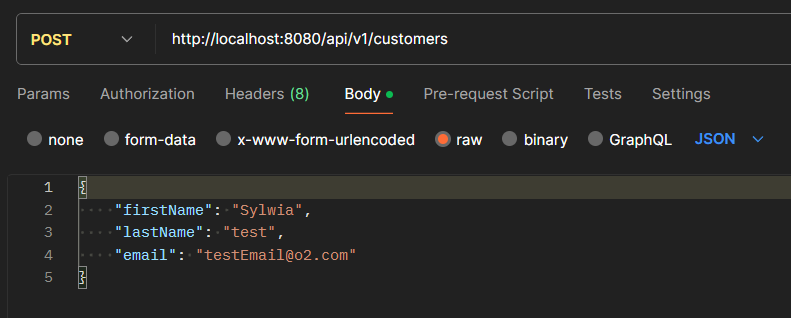
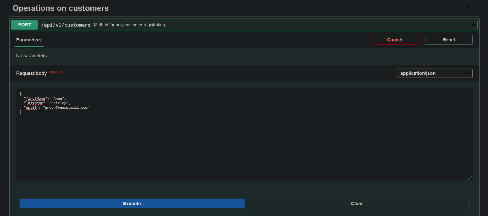

# Microservices application
An application using Microservices, Service Discovery, Load Balancer, Spring Cloud, Eureka and Spring Boot.

## Table of Contents
* [General Info](#general-information)
* [Technologies Used](#technologies-used)
* [Features](#features)
* [Screenshots](#screenshots)
* [Setup](#setup)
* [Usage](#usage)
* [Project Status](#project-status)
* [Room for Improvement](#room-for-improvement)

## General Information
This project was made to practice microservices.

## Technologies Used
Java, Eureka server, Docker, Spring, OpenAPI.

## Features
- Sending a request to create a customer,
- checking if the email is correct,
- checking if the email is taken,

## Screenshots

## Setup
Define global environment variables called `DATABASE_URL`, `POSTGRES_USERNAME`, `DATABASE_PASSWORD`, `DATABASE_NAME` and `EUREKA_URL`.
Database credentials are needed for the application to function.
To start the application use command `docker compose up`, start EurekaServerApplication, CustomerApplication and FraudApplication - in that order.

## Usage
Application can be used as a simple model of microservices.
POST request on http://localhost:8080/api/v1/customers - example: 
can be used to create a customer. Then http://localhost:8081/api/v1/fraud-check/{customerId} can be used to check if customer is a fraud.
OpenAPI option:
- http://localhost:8080/swagger-ui/index.html
- http://localhost:8081/swagger-ui/index.html
## Project Status
In progress.

## Room for Improvement
Full dockerization
